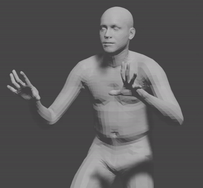

# signlanguage-motion-transfer

Rendered          |  Actual
:-------------------------:|:-------------------------:
  |  

This tool prototype allows you to enter any video of a person speaking in sign language, and applies the motion to a 3d mesh  

## Setting up! :
1. Clone this repository: 
```
git clone https://github.com/ayankashyap/signlanguage-motion-transfer.git`
```
2. Change into the repo directory: 
```
cd signlanguage-motion-transfer
```
3. Create a virtual environment (using conda or venv):  
```
python3 -m venv venv
source venv/bin/activate
```
4. Install the requirements: 
```
$ pip install requirements.txt
```
- *Note:* To run this project your system must have a GPU and CUDA installed for pytorch and several other libraries to function!
5. Download the openpose-gpu binaries from the repository's [releases page](https://github.com/CMU-Perceptual-Computing-Lab/openpose/releases) :
    1. Extract the zip file and place the openpose directory inside "signlanguage-motion-transfer"
    2. open openpose\models and run the "getModels.bat" batch file. This will download all the trained weights for openpose
6. Download and extract the SMPL-X model and VPoser from this [website](https://smpl-x.is.tue.mpg.de/) :  
- *Note:* You are required to register and agree to the SMPL terms and conditions to download the files.
7. Clone the smplify-x repository.
```
git clone https://github.com/vchoutas/smplify-x.git`
```

8. Create the following directories inside smplify-x: MODEL_FOLDER, DATA_FOLDER,  OUTPUT_FOLDER, V_POSER_FOLDER. And inside DATA_FOLDER create two more directories: images, keypoints
```
cd smplify-x
mkdir MODEL_FOLDER
mkdir OUTPUT_FOLDER
mkdir V_POSER_FOLDER
mkdir DATA_FOLDER
cd DATA_FOLDER
mkdir images
mkdir keypoints
```
-*Note* the names of the folders must be identical to the names above, or the script fails.

9. Copy the smplx folder and place it in MODEL_FOLDER. Copy the **contents** of VPoser and place it in V_POSER_FOLDER. The directory structure should be looking something like this.
```bash
smplify-x
+---cfg_files
+---DATA_FOLDER
|   +---images
|   +---keypoints
+---images
+---MODEL_FOLDER
|   +---smplx
+---OUTPUT_FOLDER
+---smplifyx
+---smplx_debug 
+---smpl_debug 
+---src    
+---VPOSER_FOLDER
    +---snapshots
    +---__pycache__
```

10. Make sure your files and folders are in place, and you are now ready to use the tool! 
```bash
signlanguage-motion-transfer
+---docs
+---openpose
+---smplify-x
``` 

<<<<<<< HEAD
11. Open a terminal to use the cli. Make sure you have activated your environment. 
=======
### You are now all setup to use the CLI !

## Using the tool  
The CLI tool has two modes: openpose and smplx. The openpose mode allows you to extract facial, hand and body joint keypoints at each frame of the video, and the smplx mode allows you to fit and render a 3d mesh to that pose. The workflow is as follows:
-*Note* make sure to do the pose estimation first as the mesh fitting relies on the 2d pose coordinates.
1. Place the video you want to analyze inside the **signlanguage-motion-transfer** directory.
2. Open a terminal and make sure you are inside the **signlanguage-motion-transfer** directory and have the python environment activated. Then to extract the pose from a video, use the following commands:
-*Note* make sure the video isn't more than 2 seconds. The tool is meant to process one sign motion at a time. This is a very GPU intensive task, and processing one frame takes about 2 minutes on a mid tier GPU, so plan accordingly
```
python main.py openpose --video <name-of-your-video.mp4>
```
3. If you also want a pose overlay on the video, then add the following flag in the command. The pose overlay file will be created inside the current directory:
```
python main.py openpose --video <name-of-your-video.mp4> --outpose 
```
4. Now that you have your pose extracted, you need to run the mesh fitting algorithm using the smplx mode. To do this, run the following command.
```
python main.py smplx --fit
```
5. After the fitting is done, the resulting 3d meshes are stored inside smplify-x/OUTPUT_FOLDER/meshes. You can open that file using any 3d graphics software like blender, or if you just want to view them in a renderer, you can run the following command:
```
python main.py smplx --render
```
6. If you have Blender installed you can import the .obj files into blender, and use shapekeys to interpolate between them. The smoothness of the animataion depends on the number of frames you processed. The gif you see at the top uses only 6 frames! .
>>>>>>> ab34846f4ae2208e74c702a4f086bae7d39986a9
